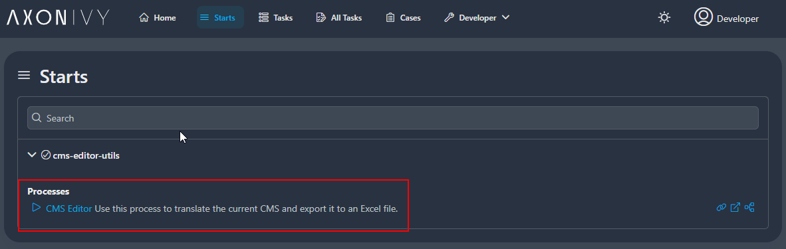
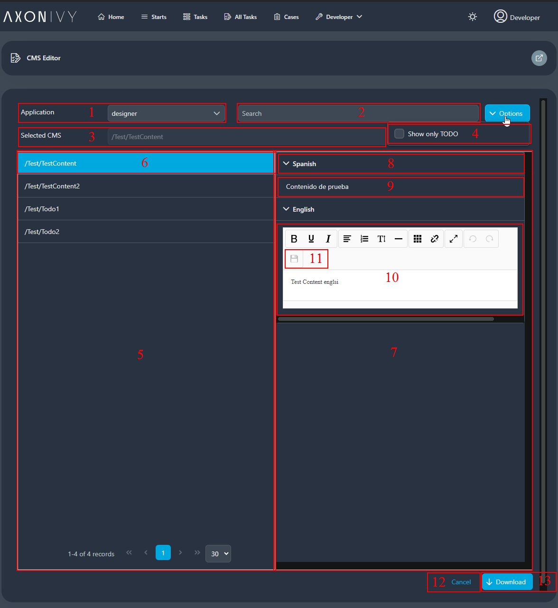

# CMS Editor
In AxonIvy, languages for UIs, notifications, or emails are managed within the CMS. We are excited to introduce the new CMS editor that significantly simplifies language editing! The key features are:

- User-friendly editor for translating new languages
- Edit an unlimited number of languages
- Simple styles available
- No HTML tags needed in the translation text

## Demo
### 1. CMS editor process start:

### 2. CMS editor main page:

1. Application Selector: Each Ivy engine can contain multiple applications. First, choose the application you want to work on.
2. Search Input: You can enter text to search by URI and content. The search is case-insensitive.
3. Selected CMS: Displays the key of the selected content.
4. Filter Only TODO: This option filters all content with the prefix 'TODO'.
5. Result Table: Displays all URIs. You can navigate to the next page and change the page size.
6. Selecting Content: Clicking on the URI loads the content into the content area.
7. Content Area: Shows all languages in preview mode.
8. Language Name: Displays the name of the languages.
9. Content: Displays the content of the language (8) in preview mode.
10. Editor: Displays the content in edit mode. You can update the content using the WYSIWYG editor.
11. Save Button: The editor does not save automatically. Click the save button to save the edited content.
12. Cancel Button: Closes the editor page.
13. Download Button: Downloads a zip file containing all translated contents.

